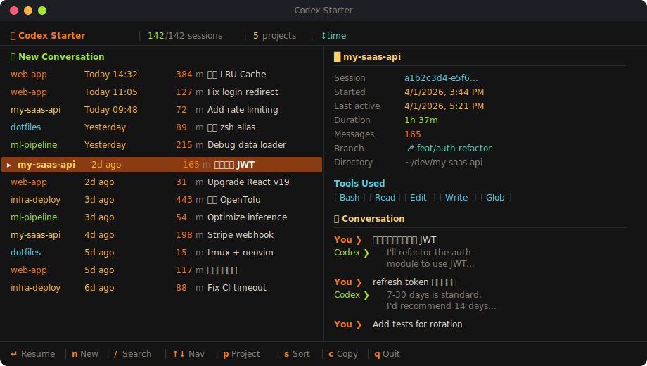

<p align="center">
  
  <br/>
  
  
  
  
</p>

<h1 align="center">🚀 Codex Starter</h1>

<p align="center">
  <strong>Codex 的主页。</strong>你的所有会话，一目了然。<br/>
  <strong>Your homepage for Codex.</strong> All your sessions, at a glance.
</p>

<p align="center">
  Built for <strong>AI-native developer workflows</strong>: local-first, resumable, searchable, and fast.
</p>

<p align="center">
  <code>npm install -g codex-starter</code>&nbsp;&nbsp;→&nbsp;&nbsp;<code>codex-starter</code>
</p>

<p align="center">
  
</p>

---

# English

## The Problem

`codex resume` is fine for continuing the last session. It is much worse for browsing old work.

If you are actually coding with agents every day, session history becomes part of your development environment. You need to recover context fast, search by intent instead of UUID, and jump back into the right repo without friction.

Once you have dozens of sessions, you usually remember:

- which repo you were in
- what the first prompt was about
- whether it was a resumable interactive CLI session

You do not remember the UUID.

## The Solution

```bash
codex-starter
```

`codex-starter` turns your local `~/.codex/sessions/**/*.jsonl` history into a browseable terminal homepage with search, project filters, rename, delete, dangerous-mode resume, and one-key continue.

It is designed for people treating coding agents as part of a real workflow, not just a toy CLI: keep everything local, reduce resume friction, and make old agent work actually reusable.

By default it only shows interactive sessions that make sense to resume. One-shot `codex exec` runs are still parseable on disk, but they are excluded from the main list so the starter does not reopen stale automation contexts.

## Features

- Warm ember-themed split-pane TUI
- Instant search with `/`
- Dangerous mode with `d`, remembered for the next launch
- Explicit launch mode selector with `m`, persisted locally
- Project filter with `p`
- Resume selected session with `Enter`
- Rename selected session with `r`
- Delete selected session with `x`
- Copy session id with `c`
- Self-update with `--update`
- Launches through your interactive shell so existing shell wrappers and env loaders still apply
- Fully local, no network, no telemetry

## Keyboard Shortcuts

| Key | Action |
|:---:|--------|
| `↑` `↓` | Navigate sessions |
| `Enter` | Start new / resume selected session |
| `n` | New session |
| `m` | Cycle launch mode (remembered) |
| `/` | Search |
| `d` | Resume or start in dangerous mode and remember it |
| `p` | Filter by project |
| `s` | Cycle sort mode |
| `c` | Copy session ID |
| `r` | Rename selected session |
| `x` / `Delete` | Delete selected session |
| `Home` / `End` | Jump to first / last |
| `Ctrl-D` / `Ctrl-U` | Page down / up |
| `Esc` | Clear filter |
| `q` / `Ctrl-C` | Quit |

## Requirements

- Node.js >= 18
- Codex CLI (`codex`) available in `PATH`

## Related Projects

- **[claude-starter](https://github.com/Bojun-Vvibe/claude-starter)** — the Claude Code counterpart with the same local-first philosophy
- **[Bojun-Vvibe](https://github.com/Bojun-Vvibe)** — more terminal UX and AI-native workflow experiments

## License

MIT

---

# 中文

## 痛点

`codex resume` 的 picker 够用，但不够适合“找历史会话”。

当你的会话越来越多时，你通常只记得这些信息：

- 当时在改哪个项目
- 第一条 prompt 大概说了什么
- 那次是不是一个可继续的交互式 CLI 会话

你不记得 UUID，也不想一个个试。

## 解决方案

`codex-starter` 把 `~/.codex/sessions/**/*.jsonl` 里的历史会话做成一个真正可浏览的终端首页。

```bash
codex-starter
```

左侧是会话列表，右侧是详情预览。支持即时搜索、项目过滤、重命名、删除、危险模式恢复和一键继续。不是冷冰冰的 session id，而是你真的说过的话。

默认只展示可直接 `codex resume <id>` 的交互式会话。像 `codex exec` 这类一次性执行记录虽然仍能被解析，但不会出现在首页列表里，避免恢复到旧的自动化工作目录并触发无关 MCP / 环境变量报错。

## 特性

| | 功能 | 说明 |
|---|---|---|
| 🎨 | **精美 TUI** | Ember Terminal 风格，暖色工业感分屏浏览 |
| ✨ | **一键新建** | 顶部直接开新会话 |
| 🔍 | **即时搜索** | `/` 开始输入，实时过滤 |
| 📂 | **项目过滤** | `p` 按工作目录筛选 |
| ⚡ | **一键恢复** | `Enter` 直接执行 `codex resume <id>` |
| 🎛️ | **显式启动模式** | `m` 在 `Default` / `Full Auto` / `Danger` 之间切换，并把选择保存到本地 |
| ☢️ | **危险模式** | `d` 以 `--dangerously-bypass-approvals-and-sandbox` 恢复或新建，并记住该模式 |
| ✏️ | **重命名** | `r` 给会话起一个更容易记住的标题 |
| 🗑️ | **删除会话** | `x` / `Delete` 删除本地 JSONL 会话 |
| 📋 | **详情预览** | 显示目录、模式、消息、工具调用 |
| 🔀 | **多种排序** | 时间 / 大小 / 消息数 / 项目 |
| 📎 | **复制 ID** | `c` 复制 session id |
| 🔄 | **自更新** | `--update` 检查并升级到 npm 最新版本 |
| 🐚 | **继承 Shell 环境** | 通过你的交互 shell 启动 `codex`，可复用 `~/.zshrc` 里的 wrapper / env |
| 🔒 | **完全本地** | 不联网，不上传，不追踪 |

## 安装

```bash
npm install -g codex-starter
```

或者从源码安装：

```bash
git clone https://github.com/Bojun-Vvibe/codex-starter.git
cd codex-starter
npm install
npm link
```

然后运行：

```bash
codex-starter
```

## 快捷键

| 按键 | 功能 |
|:---:|------|
| `↑` `↓` | 上下导航 |
| `Enter` | 新建 / 恢复会话 |
| `n` | 新建会话 |
| `m` | 切换启动模式 |
| `/` | 搜索 |
| `d` | 危险模式恢复 / 新建 |
| `p` | 按项目过滤 |
| `s` | 切换排序 |
| `c` | 复制 session ID |
| `r` | 重命名会话 |
| `x` / `Delete` | 删除会话 |
| `Home` / `End` | 跳到顶 / 底 |
| `Ctrl-D` / `Ctrl-U` | 翻页 |
| `Esc` | 清空搜索 / 过滤 |
| `q` / `Ctrl-C` | 退出 |

## 原理

它会扫描 `~/.codex/sessions/` 下的 JSONL 会话文件，解析：

- `session_meta` 里的 `cwd`、`cli_version`、`model_provider`
- `response_item` 里的用户消息、助手回复、函数调用
- 最后活跃时间、文件大小、消息数

主列表会过滤掉 `source=exec` 或 `originator=codex_exec` 的非交互执行会话，只保留适合从 TUI 中继续的会话。

会话重命名元数据持久化保存在 `~/.codex/codex-starter-meta.json`。
